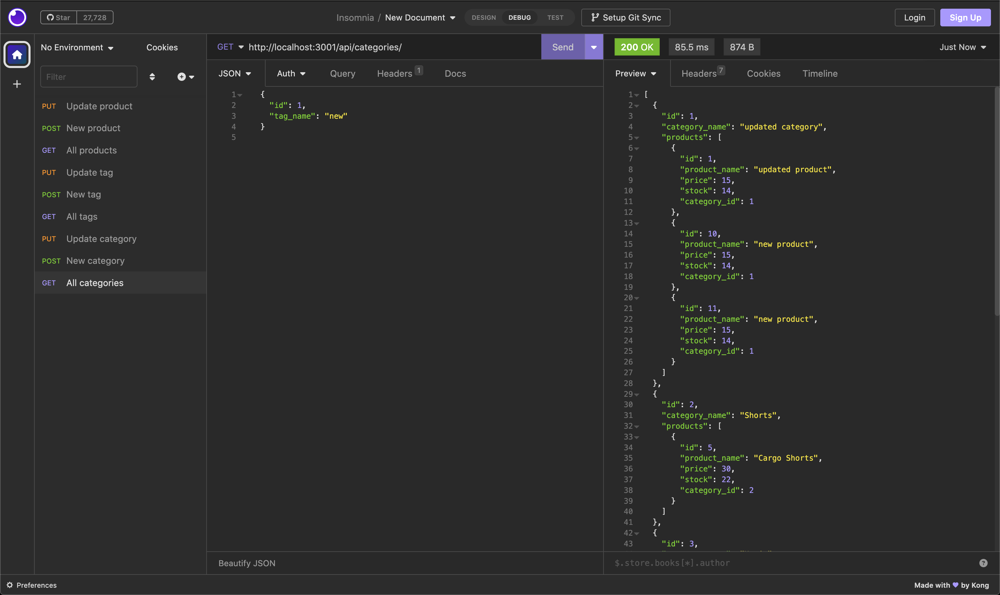

# E-commerce Back End Starter Code

## Table of Contents
1. [Description](#description)
2. [Installation](#installation)
3. [Usage](#usage)
5. [Video Walkthrough](#video-walkthrough)

## Description
This is an application for companies to track products in stock, including specifications and quantity in stock

## Installation
First, to use this app you must have mysql downloaded onto your machine. If you don't already have it installed, you can follow these instructions on the official mysql website: [mysql website](https://dev.mysql.com/doc/mysql-installation-excerpt/5.7/en/). You also must have some sort of API explorer installed such as Insomnia.

After you have installed mysql, to install this app, clone this repo to your local machine. Once cloned, navigate to the applications's root directory within your terminal and run:
```
npm install
``` 
to install the necessary dependencies. 

## Usage
To use this app, after you have installed the necessary dependencies, you will need to set up the mysql database. While in the application's root directory run the following command:
```
npm run schema
```
If you'd like to seed the database with example values, run the following:
```
npm run seed
```

Once complete run the following to start the application:
```
node server.js
```
The app should have began, now you can open insomnia (or application of choice) and start!

## Video Walkthrough
Watch video walk through here:

[](https://drive.google.com/file/d/1oipPsmbi7F7mJjC0VuPJ7z5hdhiYmA8z/view?usp=share_link)

### Checkout more of my projects [here](https://github.com/taicedtea)!
